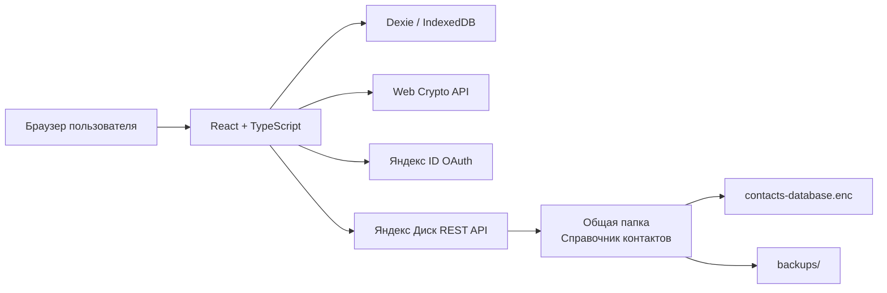

# Справочник контактов

Веб-приложение для совместной работы с единой базой рабочих контактов. Пользователи входят через Яндекс ID, работают со своей локальной копией и синхронизируют изменения через общую папку на Яндекс Диске.

Контакты не хранятся в GitHub. Репозиторий содержит только исходный код приложения и настройки сборки.

## Возможности

- вход нескольких пользователей через Яндекс ID;
- единая зашифрованная база в общей папке Яндекс Диска;
- локальная база в IndexedDB для быстрой работы и сохранения офлайн-изменений;
- синхронизация изменений между устройствами;
- защита от одновременной записи с помощью кратковременной блокировки;
- правило разрешения конфликтов «последнее изменение побеждает»;
- автоматические зашифрованные резервные копии;
- компактный интерфейс в зелёной цветовой гамме;
- поиск, фильтрация и сортировка контактов;
- организации и пользовательские группы;
- избранные контакты;
- корзина с возможностью восстановления;
- выгрузка списка контактов в Excel;
- адаптивная работа на Windows, Android и iPhone;
- публикация статической версии через GitHub Pages.

## Поля контакта

Каждая карточка контакта может содержать:

- ФИО — обязательное поле;
- рабочий телефон;
- личный телефон;
- рабочий email;
- личный email;
- место работы;
- структурное подразделение;
- должность;
- заметки;
- одну или несколько групп;
- признак «Избранное»;
- дату создания и изменения;
- дату удаления для записей в корзине.

## Архитектура



Основные компоненты:

- **React + TypeScript** — пользовательский интерфейс и логика приложения;
- **Vite** — разработка и сборка;
- **Dexie / IndexedDB** — локальная рабочая копия;
- **Web Crypto API** — AES-GCM-шифрование базы;
- **PBKDF2** — получение ключа шифрования из общего пароля;
- **Яндекс ID OAuth** — вход пользователей;
- **Яндекс Диск REST API** — хранение зашифрованной базы и резервных копий;
- **GitHub Actions + GitHub Pages** — автоматическая публикация приложения.

## Хранение данных

В общей папке Яндекс Диска используются следующие файлы:

```text
Справочник контактов/
├── contacts-database.enc
├── sync-lock.json          # существует только во время записи
└── backups/
    └── contacts-YYYY-MM-DD.enc
```

`contacts-database.enc` содержит зашифрованные контакты, организации, группы, корзину и служебные метаданные.

Пароль шифрования:

- не отправляется на Яндекс Диск;
- не сохраняется в GitHub;
- не должен находиться в `.env`;
- должен передаваться участникам отдельно;
- не может быть восстановлен при утрате.

## Требования

- Node.js `20.19` или новее;
- npm;
- современный браузер с поддержкой Web Crypto API и IndexedDB;
- приложение в кабинете Яндекс OAuth;
- общая папка Яндекс Диска с правом редактирования для всех участников.

## Установка

```bash
git clone https://github.com/ancode5/phone-contacts-app.git
cd phone-contacts-app
npm install
```

Создайте локальный файл `.env.local` на основе `.env.example`:

```env
VITE_YANDEX_CLIENT_ID=ваш_публичный_client_id
VITE_YANDEX_REDIRECT_URI=http://localhost:5173/auth/callback
VITE_YANDEX_DISK_FOLDER=Справочник контактов
```

`VITE_YANDEX_CLIENT_ID` является публичным идентификатором приложения. **Client Secret нельзя добавлять во frontend, `.env.local` или репозиторий.**

## Настройка Яндекс OAuth

Для локальной разработки добавьте Redirect URI:

```text
http://localhost:5173/auth/callback
```

Для версии на GitHub Pages добавьте Redirect URI:

```text
https://ancode5.github.io/phone-contacts-app/
```

Зарегистрированный Redirect URI должен полностью совпадать с адресом, который использует приложение.

Для работы с общей папкой приложению нужны права на:

- чтение Яндекс Диска;
- запись на Яндекс Диск;
- получение основных данных аккаунта.

## Локальный запуск

```bash
npm run dev
```

Откройте:

```text
http://localhost:5173/
```

Проверка типов:

```bash
npm run typecheck
```

Проверка кода:

```bash
npm run lint
```

Сборка:

```bash
npm run build
```

Локальный просмотр production-сборки:

```bash
npm run preview
```

## Первый запуск

1. Владелец общей папки входит через Яндекс ID.
2. Приложение проверяет папку `Справочник контактов`.
3. При отсутствии облачной базы приложение предлагает создать её.
4. Владелец задаёт общий пароль шифрования длиной не менее 10 символов.
5. Создаётся файл `contacts-database.enc`.
6. Остальные участники входят под своими Яндекс-аккаунтами и вводят тот же пароль.

Начинать работу рекомендуется с нескольких тестовых контактов.

## Синхронизация

Приложение использует локальную базу как основное рабочее хранилище. Интерфейс не должен ждать Яндекс Диск при каждом открытии карточки.

Синхронизация запускается:

- после сохранения изменения;
- при открытии приложения;
- при возвращении вкладки в активное состояние;
- после восстановления интернет-соединения;
- вручную по команде обновления.

При записи приложение кратковременно создаёт `sync-lock.json`. Просроченная блокировка удаляется автоматически. Чтение облачной базы выполняется без длительного удержания блокировки.

При изменении одной записи на разных устройствах используется правило: версия с более поздним временем изменения побеждает.

## Работа без интернета

При отсутствии сети изменения сохраняются в IndexedDB текущего устройства. После восстановления соединения приложение пытается объединить локальную и облачную версии.

Нужно учитывать:

- удалённо стереть локальную копию с устройства, которое остаётся офлайн, невозможно;
- после отзыва доступа пользователь не сможет синхронизироваться, но старая локальная копия может сохраняться до выхода из приложения или очистки данных браузера;
- для доверенной небольшой команды рекомендуется при исключении пользователя сменить пароль шифрования и перезаписать базу.

## Резервные копии

Перед важными изменениями приложение сохраняет зашифрованные резервные копии в папке `backups`.

Резервная копия содержит только зашифрованные данные. Для восстановления требуется тот же пароль, которым база была зашифрована.

Не следует удалять `contacts-database.enc` вручную без предварительной резервной копии.

## Выгрузка в Excel

Кнопка **«Выгрузить в Excel»** создаёт файл со справочником для просмотра, печати или передачи ответственному сотруднику.

Экспорт предназначен для резервной и административной работы. Изменение Excel-файла не изменяет облачную базу автоматически.

## Публикация через GitHub Pages

Проект публикуется без стороннего хостинга.

После добавления workflow GitHub Actions:

1. отправьте изменения в репозиторий;
2. откройте **Settings → Pages**;
3. в поле **Source** выберите **GitHub Actions**;
4. дождитесь успешного выполнения workflow в разделе **Actions**;
5. откройте приложение по адресу:

```text
https://ancode5.github.io/phone-contacts-app/
```

После следующих `git push` GitHub автоматически пересобирает и публикует приложение.

## Структура проекта

```text
phone-contacts-app/
├── .github/workflows/       # публикация GitHub Pages
├── public/                  # статические файлы и PWA-ресурсы
├── src/
│   ├── auth/                # Яндекс OAuth
│   ├── components/          # React-компоненты
│   ├── constants/           # стартовые данные и настройки
│   ├── db/                  # Dexie / IndexedDB
│   ├── services/            # Яндекс Диск, шифрование, синхронизация
│   ├── types/               # TypeScript-типы
│   ├── App.tsx
│   └── main.tsx
├── .env.example
├── package.json
├── vite.config.ts
└── README.md
```

## Безопасность

Репозиторий может быть публичным при соблюдении следующих правил:

- не добавлять реальные контакты;
- не добавлять OAuth-токены;
- не добавлять Client Secret;
- не добавлять пароль шифрования;
- не добавлять `.env.local`;
- не добавлять экспортированные файлы с контактами;
- не публиковать содержимое общей папки Яндекс Диска.

Рекомендуемые исключения в `.gitignore`:

```gitignore
node_modules/
dist/
.env
.env.*
!.env.example
*.enc
*.contacts.json
*.contacts.xlsx
```

## Ограничения

- это файловая синхронизация, а не серверная база данных в реальном времени;
- общий пароль шифрования нельзя восстановить;
- безопасность доступа к папке зависит от настроек общего доступа Яндекс Диска;
- OAuth-токен даёт приложению заявленные разрешения Яндекс Диска;
- при длительной работе двух устройств офлайн возможны изменения одной записи, которые будут разрешены по правилу последнего обновления;
- перед использованием с реальными данными необходимо проверить резервное копирование и восстановление.

## Планы развития

- поиск и объединение дубликатов по ФИО и телефонам;
- массовое добавление контактов в группы;
- расширенное управление резервными копиями;
- более подробный журнал синхронизации;
- улучшение установки и офлайн-режима PWA;
- административное управление участниками и сменой ключа шифрования.

## Лицензия

Лицензия проекта пока не указана. До добавления файла `LICENSE` использование, изменение и распространение кода регулируется авторским правом владельца репозитория.
